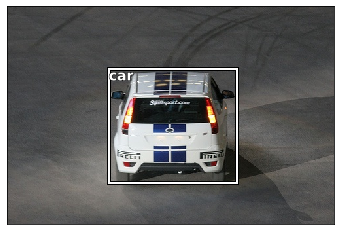
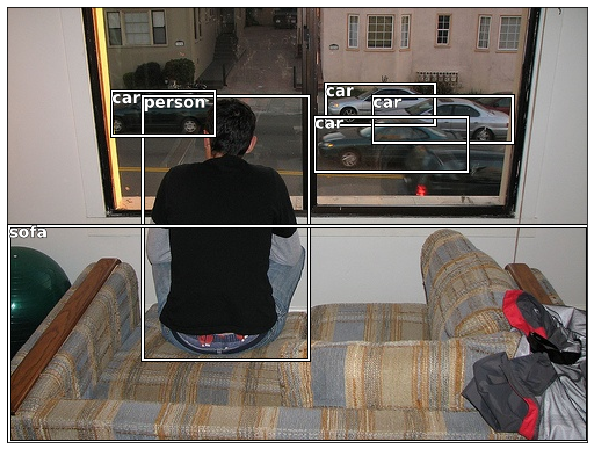
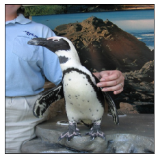
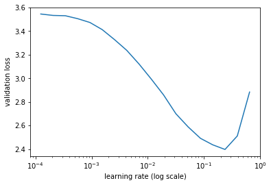
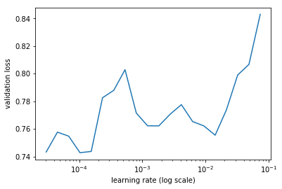
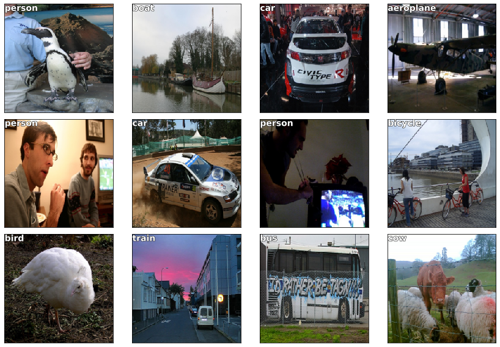
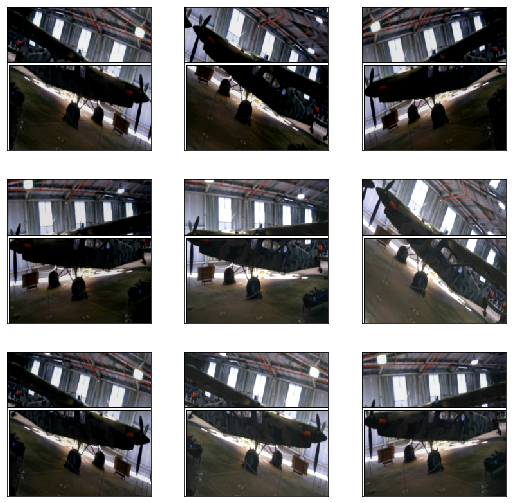
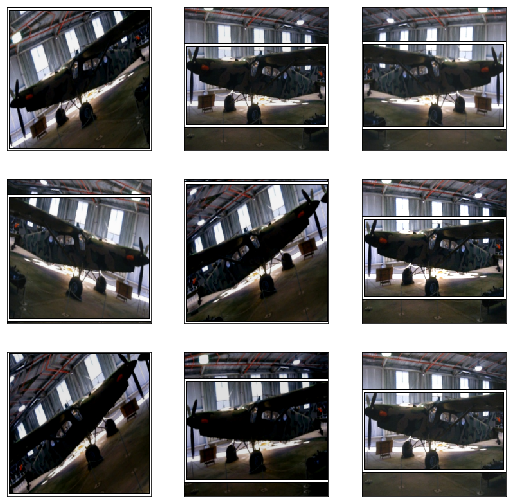
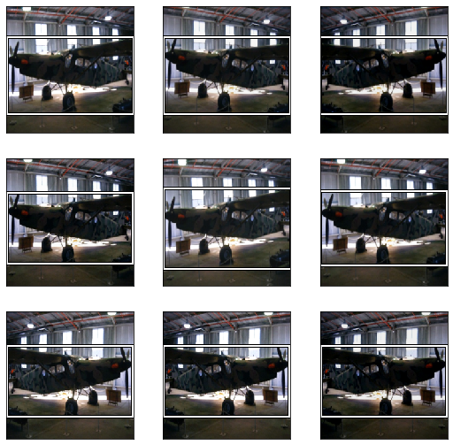

```python
%matplotlib inline
%reload_ext autoreload
%autoreload 2
```


```python
from fastai.conv_learner import *
from fastai.dataset import *


```


```python
from pathlib import Path
import json
from PIL import ImageDraw, ImageFont
from matplotlib import patches, patheffects
```

I will use the Pascal VOC dataset, of the 2007 cometition


```python
PATH = Path("data/VOC2007")
```


```python
list(PATH.iterdir())
```


    [WindowsPath('data/VOC2007/Annotations'),
     WindowsPath('data/VOC2007/ImageSets'),
     WindowsPath('data/VOC2007/JPEGImages'),
     WindowsPath('data/VOC2007/pascal_test2007.json'),
     WindowsPath('data/VOC2007/pascal_train2007.json'),
     WindowsPath('data/VOC2007/pascal_train2012.json'),
     WindowsPath('data/VOC2007/pascal_val2007.json'),
     WindowsPath('data/VOC2007/pascal_val2012.json'),
     WindowsPath('data/VOC2007/PASCAL_VOC'),
     WindowsPath('data/VOC2007/SegmentationClass'),
     WindowsPath('data/VOC2007/SegmentationObject'),
     WindowsPath('data/VOC2007/tmp')]


The labels are json


```python
train_bbox = json.load((PATH/"pascal_train2007.json").open())
```


```python
train_bbox.keys()
```


    dict_keys(['images', 'type', 'annotations', 'categories'])


```python
IMAGES, ANNOTATIONS, CATEGORIES = ["images", "annotations", "categories"]
train_bbox[IMAGES][0:10]
```


    [{'file_name': '000012.jpg', 'height': 333, 'width': 500, 'id': 12},
     {'file_name': '000017.jpg', 'height': 364, 'width': 480, 'id': 17},
     {'file_name': '000023.jpg', 'height': 500, 'width': 334, 'id': 23},
     {'file_name': '000026.jpg', 'height': 333, 'width': 500, 'id': 26},
     {'file_name': '000032.jpg', 'height': 281, 'width': 500, 'id': 32},
     {'file_name': '000033.jpg', 'height': 366, 'width': 500, 'id': 33},
     {'file_name': '000034.jpg', 'height': 500, 'width': 360, 'id': 34},
     {'file_name': '000035.jpg', 'height': 375, 'width': 500, 'id': 35},
     {'file_name': '000036.jpg', 'height': 500, 'width': 332, 'id': 36},
     {'file_name': '000042.jpg', 'height': 335, 'width': 500, 'id': 42}]


```python
train_bbox[ANNOTATIONS][:1]
```


    [{'segmentation': [[155, 96, 155, 270, 351, 270, 351, 96]],
      'area': 34104,
      'iscrowd': 0,
      'image_id': 12,
      'bbox': [155, 96, 196, 174],
      'category_id': 7,
      'id': 1,
      'ignore': 0}]


```python
train_bbox[CATEGORIES][:5]
```


    [{'supercategory': 'none', 'id': 1, 'name': 'aeroplane'},
     {'supercategory': 'none', 'id': 2, 'name': 'bicycle'},
     {'supercategory': 'none', 'id': 3, 'name': 'bird'},
     {'supercategory': 'none', 'id': 4, 'name': 'boat'},
     {'supercategory': 'none', 'id': 5, 'name': 'bottle'}]


```python
FILE_NAME, ID, IMG_ID, CAT_ID, BBOX = 'file_name','id','image_id','category_id','bbox'
```

create dictionaries indexed by id and the content

All dictionaries are indexed by image id so you can stablish the relationships between
    - imageId - category
    - imageId - file name


```python
categories = {c[ID]: c["name"] for c in train_bbox[CATEGORIES]}
train_images = { i[ID]: i[FILE_NAME] for i in train_bbox[IMAGES]}
train_ids = { i[ID] for i in train_bbox[IMAGES]}
```

Find the path to images


```python
JPEG_FILES = PATH/"JPEGImages"

list(JPEG_FILES.iterdir())[:5]
```


    [WindowsPath('data/VOC2007/JPEGImages/000005.jpg'),
     WindowsPath('data/VOC2007/JPEGImages/000007.jpg'),
     WindowsPath('data/VOC2007/JPEGImages/000009.jpg'),
     WindowsPath('data/VOC2007/JPEGImages/000012.jpg'),
     WindowsPath('data/VOC2007/JPEGImages/000016.jpg')]


```python
annotations = train_bbox[ANNOTATIONS]
annotations[:1]
```


    [{'segmentation': [[155, 96, 155, 270, 351, 270, 351, 96]],
      'area': 34104,
      'iscrowd': 0,
      'image_id': 12,
      'bbox': [155, 96, 196, 174],
      'category_id': 7,
      'id': 1,
      'ignore': 0}]


```python
def hw_bb(bb):
    """
    converts the bounding box from [horizontal x, vertical y, height, width] to [(top left corner) x, y, (bottom_right corner) x, y]
    """
    return np.array([bb[1], bb[0], bb[3]+bb[1]-1, bb[2]+bb[0]-1])
```


```python
def bb_hw(hw):
    """
    converts the bounding box from  [top left corner, bottom right corner] to [top lef tcorner, height, width]
    """
    return np.array([hw[1], hw[0], hw[3] - hw[1] + 1, hw[2] - hw[0] +1])
```


```python
train_annotations = collections.defaultdict(lambda: [])

for a in annotations:
    if not a["ignore"]:
        bb = hw_bb(a["bbox"])
        train_annotations[a[IMG_ID]].append((bb, a[CAT_ID]))
```


```python
len(train_annotations)
```


    2501


# See the data
lests draw an immage with its annotations and noames


```python
image = train_bbox[IMAGES][0]
image
```


    {'file_name': '000012.jpg', 'height': 333, 'width': 500, 'id': 12}


```python
img_annotations = train_annotations[image[ID]]
img_annotations[1]
```


    ---------------------------------------------------------------------------

    IndexError                                Traceback (most recent call last)

    <ipython-input-21-99f1a25a5578> in <module>
          1 img_annotations = train_annotations[image[ID]]
    ----> 2 img_annotations[1]
    

    IndexError: list index out of range


```python
im = open_image(JPEG_FILES/image["file_name"])
```


```python
def show_img(im, figsize=None, ax=None):
    if not ax: fig,ax = plt.subplots(figsize=figsize)
    ax.imshow(im)
    ax.get_xaxis().set_visible(False)
    ax.get_yaxis().set_visible(False)
    return ax

def draw_rect(ax, b):
    patch = ax.add_patch(patches.Rectangle(b[:2], *b[-2:], fill=False, edgecolor='white', lw=2))
    draw_outline(patch, 4)
    
def draw_outline(o, lw):
    o.set_path_effects([patheffects.Stroke(
        linewidth=lw, foreground='black'), patheffects.Normal()])
    
def draw_text(ax, xy, txt, sz=14):
    text = ax.text(*xy, txt,
        verticalalignment='top', color='white', fontsize=sz, weight='bold')
    draw_outline(text, 1)
```


```python
ax = show_img(im)
b = bb_hw(img_annotations[0][0])
draw_rect(ax, b)
draw_text(ax, b[:2], categories[img_annotations[0][1]])
```





```python
def draw_im(im, ann):
    ax = show_img(im, figsize=(16,8))
    for b,c in ann:
        b = bb_hw(b)
        draw_rect(ax, b)
        draw_text(ax, b[:2], categories[c], sz=16)
        
def draw_idx(i):
    im_a = train_annotations[i]
    im = open_image(JPEG_FILES/train_images[i])
    print(im.shape)
    draw_im(im, im_a)
```


```python
draw_idx(554)
```

    (375, 500, 3)
    





# Largest item classifier

Lest do a classfifier that identifies the biggest item in an image


```python
def get_lrg(b):
    if not b: raise Exception(b)
    b = sorted(b, key=lambda x: np.product(x[0][-2:]-x[0][:2]), reverse=True)
    return b[0]
```


```python
trn_largest_anno = {a: get_lrg(b) for a,b in train_annotations.items()}
```


```python
(PATH/"tmp").mkdir(exist_ok=True)
CSV  = PATH/"tmp/largest_item.csv"
```


```python
dataFrame = pd.DataFrame(data = {
    "fn": [train_images[i] for i in train_ids],
    "cat": [categories[trn_largest_anno[i][1]] for i in train_ids],
}, columns= ["fn", "cat"])

```


```python
dataFrame.to_csv(CSV, index=False)
```

# Classification

steps
1. define architecture
2. define batch size
3. create transformations
4. create an image classifier
5. find learning rate with ConvLearner
6. fit model
7. unfreeze layers and fit


```python
arch = resnet34
sz = 224
bs = 64
```


```python
tfms = tfms_from_model(f_model = arch, sz=sz, aug_tfms=transforms_side_on, crop_type=CropType.NO)
md = ImageClassifierData.from_csv("./", JPEG_FILES, CSV, tfms=tfms, bs = bs)
```


```python
x,y=next(iter(md.val_dl))
```


```python
show_img(md.val_ds.denorm(to_np(x))[0]);
```





```python
learn = ConvLearner.pretrained(arch, md, metrics=[accuracy])
```


```python
learn.opt_fn = optim.Adam
```


```python
lrf = learn.lr_find(1e-5, 100)
```


    HBox(children=(IntProgress(value=0, description='Epoch', max=1, style=ProgressStyle(description_width='initial…


    
     78%|███████████████████████████████████████████████████████▍               | 25/32 [00:11<00:03,  1.83it/s, loss=5.76]


```python
learn.sched.plot(n_skip=5, n_skip_end=1)
```





```python
lr = 2e-2
```


```python
learn.fit(lr, 1, cycle_len=1)
```


    HBox(children=(IntProgress(value=0, description='Epoch', max=1, style=ProgressStyle(description_width='initial…


    epoch      trn_loss   val_loss   accuracy                                                                              
        0      1.223465   0.708285   0.794     
    


    [array([0.70828]), 0.794]


```python
lrs = np.array([lr/1000,lr/100,lr])
learn.freeze_to(-2)
```


```python
lrf=learn.lr_find(lrs/1000)
learn.sched.plot(1)
```


    HBox(children=(IntProgress(value=0, description='Epoch', max=1, style=ProgressStyle(description_width='initial…


    
     84%|███████████████████████████████████████████████████████████▉           | 27/32 [00:14<00:02,  2.08it/s, loss=2.36]





```python
learn.fit(lrs/5, 1, cycle_len=2)
```


    HBox(children=(IntProgress(value=0, description='Epoch', max=2, style=ProgressStyle(description_width='initial…


    epoch      trn_loss   val_loss   accuracy                                                                              
        0      0.7591     0.620626   0.78      
        1      0.540552   0.608486   0.78                                                                                  
    


    [array([0.60849]), 0.7800000019073486]


```python
learn.save('clas_one')
```


```python
learn.load('clas_one')
```


```python
x,y = next(iter(md.val_dl))
probs = F.softmax(predict_batch(learn.model, x), -1)
x,preds = to_np(x),to_np(probs)
preds = np.argmax(preds, -1)
```


```python
fig, axes = plt.subplots(3, 4, figsize=(12, 8))
for i,ax in enumerate(axes.flat):
    ima=md.val_ds.denorm(x)[i]
    b = md.classes[preds[i]]
    ax = show_img(ima, ax=ax)
    draw_text(ax, (0,0), b)
plt.tight_layout()
```

    Clipping input data to the valid range for imshow with RGB data ([0..1] for floats or [0..255] for integers).
    





# Bounding box

We'll try to find the bounding box around an object.

To find the bounding box, we use a multiple regresion, we will train the model to predict 4 values, one for each coordinate

this means each output will need to be countinous with any number between 0 and 244 (imagesize)

So following a differential programming approach we need
 - Predict 4 contiuous values
 

So the neural network will have at the end 4 neurons, each without activation, to produce a continous value

To train the network we need to use a function that is lower when the four numbers have less error
 - we can use Mean square error
 - Also L1 function 


```python
BB_CSV = PATH/"tmp/bb.csv"
```

We will use the largest annotation per image, and discard the category information for now, since right now we are only building a bounding box predictor


```python
bb = np.array([trn_largest_anno[i][0] for i in train_ids])
```

For fastai reasons we need to put the four values in the same column separated  by spaces


```python
bbs = [" ".join(str(v) for v in boundingbox) for boundingbox in bb ]
```


```python
data = {"fn": [train_images[i] for i in train_ids],"bbox": bbs}
df = pd.DataFrame(data, columns=["fn", "bbox"])
df.to_csv(BB_CSV, index = False)
```

For the pretrained architecture we will use resnet34 again, with the same file size and batch size


```python
f_model=resnet34
sz=224
bs=64
```

Because this is a regresion problem (meaning the output will be 4 numbers instead of a classification) we need to do some customization

1. Set `continous = True` so fastai won't
 - one-hot encode the labels
 - use Mean Square Error as the default loss function

2. Tell the transforms that our labels are coordinates so that they are transformed with the image. (this is why we have that weird way of defining bboxes "topleftcorner, bottomrightcorner"

3. create our own set of augmentations, to void to high rotations that make the bb unreal

4. Set CropType.NO so that the images are squished to 224 rather than cropped


```python
augmentations = [ RandomFlip(),
                  RandomRotate(30),
                  RandomLighting(0.1,0.1)]
```


```python
tfms = tfms_from_model(f_model, sz, crop_type=CropType.NO, aug_tfms=augmentations)
md = ImageClassifierData.from_csv("./", JPEG_FILES, BB_CSV, tfms=tfms, continuous=True)
```


```python
idx=3
fig,axes = plt.subplots(3,3, figsize=(9,9))
for i,ax in enumerate(axes.flat):
    x,y=next(iter(md.aug_dl))
    ima=md.val_ds.denorm(to_np(x))[idx]
    b = bb_hw(to_np(y[idx]))
    print(b)
    show_img(ima, ax=ax)
    draw_rect(ax, b)
```

    [  1.  89. 499. 192.]
    [  1.  89. 499. 192.]
    [  1.  89. 499. 192.]
    [  1.  89. 499. 192.]
    [  1.  89. 499. 192.]
    

    Clipping input data to the valid range for imshow with RGB data ([0..1] for floats or [0..255] for integers).
    

    [  1.  89. 499. 192.]
    

    Clipping input data to the valid range for imshow with RGB data ([0..1] for floats or [0..255] for integers).
    

    [  1.  89. 499. 192.]
    [  1.  89. 499. 192.]
    

    Clipping input data to the valid range for imshow with RGB data ([0..1] for floats or [0..255] for integers).
    

    [  1.  89. 499. 192.]
    





```python
augs = [RandomFlip(tfm_y=TfmType.COORD),
        RandomRotate(30, tfm_y=TfmType.COORD),
        RandomLighting(0.1,0.1, tfm_y=TfmType.COORD)]
```


```python
tfms = tfms_from_model(f_model, sz, crop_type=CropType.NO, tfm_y=TfmType.COORD, aug_tfms=augs)
md = ImageClassifierData.from_csv("./", JPEG_FILES, BB_CSV, tfms=tfms, continuous=True, bs=4)
```


```python
idx=3
fig,axes = plt.subplots(3,3, figsize=(9,9))
for i,ax in enumerate(axes.flat):
    x,y=next(iter(md.aug_dl))
    ima=md.val_ds.denorm(to_np(x))[idx]
    b = bb_hw(to_np(y[idx]))
    print(b)
    show_img(ima, ax=ax)
    draw_rect(ax, b)
```

    [  0.   3. 224. 220.]
    [  1.  60. 221. 125.]
    [  0.  56. 223. 133.]
    

    Clipping input data to the valid range for imshow with RGB data ([0..1] for floats or [0..255] for integers).
    

    [  0.  25. 224. 194.]
    [  0.   5. 224. 218.]
    [  1.  60. 221. 125.]
    

    Clipping input data to the valid range for imshow with RGB data ([0..1] for floats or [0..255] for integers).
    

    [  0.   0. 224. 223.]
    [  0.  44. 224. 157.]
    [  1.  60. 221. 125.]
    





```python
tfm_y = TfmType.COORD
augs = [RandomFlip(tfm_y=tfm_y),
        RandomRotate(3, p=0.5, tfm_y=tfm_y),
        RandomLighting(0.05,0.05, tfm_y=tfm_y)]

tfms = tfms_from_model(f_model, sz, crop_type=CropType.NO, tfm_y=tfm_y, aug_tfms=augs)
md = ImageClassifierData.from_csv("./", JPEG_FILES, BB_CSV, tfms=tfms, bs=bs, continuous=True)
```


```python
idx=3
fig,axes = plt.subplots(3,3, figsize=(9,9))
for i,ax in enumerate(axes.flat):
    x,y=next(iter(md.aug_dl))
    ima=md.val_ds.denorm(to_np(x))[idx]
    b = bb_hw(to_np(y[idx]))
    print(b)
    show_img(ima, ax=ax)
    draw_rect(ax, b)
```

    [  0.  55. 224. 135.]
    

    Clipping input data to the valid range for imshow with RGB data ([0..1] for floats or [0..255] for integers).
    

    [  0.  55. 223. 135.]
    [  0.  55. 224. 135.]
    [  1.  60. 221. 125.]
    [  0.  52. 224. 141.]
    

    Clipping input data to the valid range for imshow with RGB data ([0..1] for floats or [0..255] for integers).
    

    [  0.  57. 223. 131.]
    

    Clipping input data to the valid range for imshow with RGB data ([0..1] for floats or [0..255] for integers).
    

    [  1.  60. 221. 125.]
    

    Clipping input data to the valid range for imshow with RGB data ([0..1] for floats or [0..255] for integers).
    

    [  1.  60. 221. 125.]
    

    Clipping input data to the valid range for imshow with RGB data ([0..1] for floats or [0..255] for integers).
    

    [  1.  60. 221. 125.]
    




