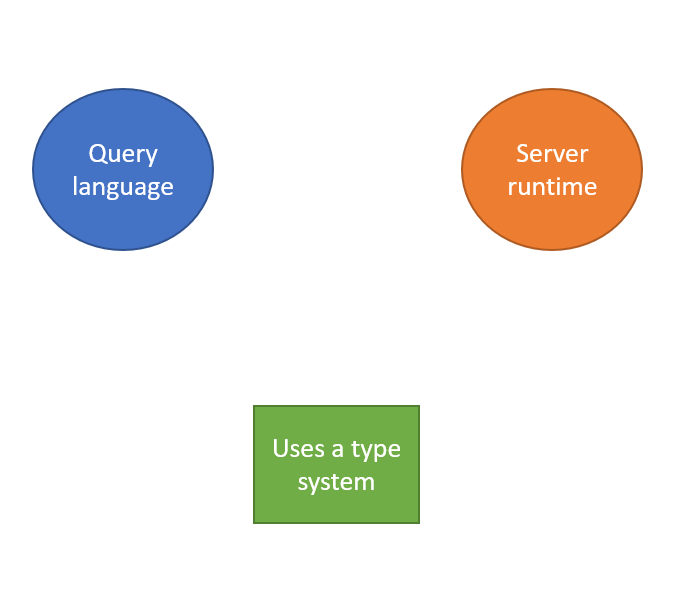
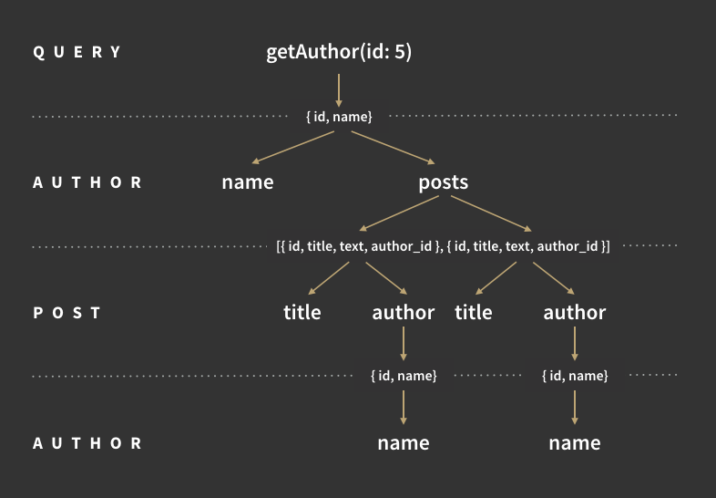
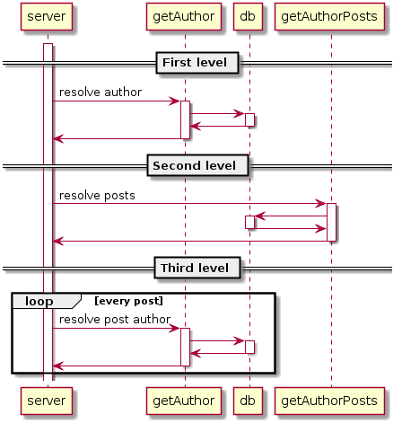

# Graph ql workshop

## Summary

Explain with a concepts + hands on workshop the graphql mental model and implementation

## What is GraphQL

> GraphQL is a query language for you API, and server runtime for executing queries by using a type system to define tour data.

what is it?

- Query Language. A way to ask the API for your data
- Server Runtime: A way for the server to anwser for those queries
- It uses a type system as a cornerstone to work. Some of its best features coudn't exist without this

### Type system

Everything starts with the cornerstone, in graphQL you define a Schema. you use the **Schema Definition Language** to do so.

#### Scalar types

It has five scalar types that are the base for all the type definitons. You can define your own but this is out the scope

- `Int`: Signed 32 bit integer
- `Float`: Floating-point number
- `String`: UTF-8 character sequence
- `Boolean`: true, false
- `ID`: Serialized as a string

With these base types we can define any schema, for example

    type Author {
    	id: ID!
    	name: String
    	posts: [Post]
    }

    type Post {
    	id: ID!
    	title: String
    	content: String
    	author: User
    }

    ...

This is the type system of our application, it defines what each entity has and how they are related.

## Schema

But this definition does not expose any functionality to our clients yet. To do that we must define a schema

it is a special type that exposes functionallity to our users yei!!![

    schema {
    	query: {
    		getAuthor(id: ID!): User
    		post(id: ID!): Post
    	}
    	mutation: {
    		createUser(name: String): User
    		createPost(post: Post): Post
    	}
    }

It defines the entry points of every GraphQL query.

query is intended for read operations

mutation is intended for write operations

    type Query {
    	getAuthor(id: ID!): User
    	post(id: ID!): Post
    }

    type Mutation {
    	createUser(name: String): User
    }

Mutation and Query are normal types, nothing special about them other that their fucntion.

## Query Language

As I said before the type system is the base that supports everithing else. The Query language i.e. how is the grapql going to be used is very tied to the type system

A query is nothing more than a selection of fields

    { \\ magic "root" object
    	user(id: "123"){
    		name
    		posts: {
    			title
    			author: {
    				name
    			}
    		}
    	}

    }

We are using the user query that was defined earlier and from there, It is just a selection of fields. All the fields must be on the Schema definition, you cannot ask for something that was not defined.

This has some advantages that are not evident at first.

- The client knows exactly what he is getting from the API
- He knows it because he specifically choose what to get
- The server implementation is completely abstracted from the client. could be on DB or multiple, mucroservices, anything, you would still query it the same way
- Because the client can have the Schema definition, some advanced cache techniques can be built.

[Relay · The production-ready GraphQL client for React.](https://relay.dev/)

[Apollo GraphQL](https://www.apollographql.com/)

do a query playground maybe?

## Server Runtime

It all sounds great for the client but what about the server? How does it handle a "custom" query efficiently

First lest see the big pucture, any graphQl server performs three tasks

1. Parse
2. Valdiate
3. Execute

Step One and two are automatic

### Parse

The query is parsed to an AST, (abstract syntax tree) and return error if found

### Valdiate

It validates the query with the Schema

is the "user(id: ID!)" in the Query object?

does the user type has a name and posts

...

This validation is automatic, this removes some boilerplate from the implementation

### Execute

up to this point the Query has been parsed and validated, so the server has a tree representation of it. Yes your query is turned in to a tree, queries are never circular even in weird cases like this one.

    {
    	getAuthor(id: 5){
    		name
    		posts: {
    			title
    			author: {
    				name
    			}
    		}
    	}
    }

this query is transformed to

### Resolve functions

Resolver functions, know how to get the data for each field. These are implemented by you and can do whatever is needed to get the data. You need to define a resolver function for every Non-Scalar type in your schema

These could be realy simple like:

    function authorName(author){
    	return author.name;
    }

or more complex like

    function author(authorId){
     return	db.query("SELECT * from authors where author.id == authorId)
    }

### Execution flow

The server executes the resolver functions for each value, by level All the resolvers at the same level are executed in parallel

As you can see here the same author is fetched many times from the database, one at the top and then one per post. So in reality GraphQL servers implement clever batching and caching logic to avoid this problem.
