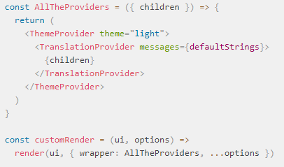

###### This is my interpretation of the official react-testing library documentation

The testing library has a different approach from other testing libraries like enzyme or test utils. It avoids at all cost the use of react implementation details during testing, it forces you to test your component by working directly with the DOM, And it intentionally lacks the support for Shallow testing (you can but is not easy nor recommended).

They do this because implementation details create shortcuts that make your tests easy to write but at the same time defeat the purpose of the test, The user does not have access to this shortcuts and in some cases the test passes but the functionality is broken. 

## Principles

- **The More your test resemble the way your software is used, the more confidence they can give you**
- Based on DOM testing library
- It only provides utilities to query DOM in a way similay to how the user finds elements in the DOM. i.e. by the text, or label, etc.
- It encourages to test based on how the page looks rather than focusing on implementation details
- not bound to any particular UI framework
- not bounded to a particular test runner but jest is recommended

## react

It discourages accessing the component instances or searching the DOM for a particular Component like enzyme does.

### Setup

It does not require any configuration to be used, however there is some considerations to improve the developer experience

- You must run cleanup after every test. Otherwise you might have memory leaks.
- Create a custom renderer: In react having App level providers is a very common practice, things like Redux or Translations often are built with the context API thus have a Prover at the top of the DOM tree. You can create a custom renderer to Wrap your components with ease

- Custom Queries: Generaly this is discouraged but you can. see the documentation Here([https://testing-library.com/docs/react-testing-library/setup#add-custom-queries](https://testing-library.com/docs/react-testing-library/setup#add-custom-queries))

### API

The most important function is the render function.

### render

It fully renders the received component on a div (by default, you can change it). 

    function render(
      ui: React.ReactElement<any>,
      options?: {
        /* You won't often use this, see testing library docs for more info */
      }
    ): RenderResul

It returns a **Render Result** object. 

- **Queries**: It returns all the testing library queries bounded to the resultant DOM so you can use them better.
- container: The DOM node (div) where your component was rendered. You can access your component with **container.firstChild** (unless your component renders a Fragment)
- baseElement: The containing DOM where your React Component is rendered. Useful to test thinds like React Portals that may render things outside its parent
- debug: Prints the DOM in a pretty format
- **rerenderer:**  it offers the posibility to re render your component with different props, so you can test the result of the change
- unmount: it unmounts your component

### Quieries

The second most important feature in the library are the queries function they provide. 

They all have the objective to extract DOM elements out of the container in a way similar to what your users would do. A user looks for something in a page by the **text**, **placeholder**, **label**, **title**. I know Not always but 90% of the time thats what your user sees and uses to navigate through the page. 

**Escape hatch:** For those times that is not practical to get a DOM element with traditional approaches the testing library offers a way to do it **data-testid** you expecify the data in your html tag and the method **ByTestId** will find it for you.

> You can do "document.QuerySelector()" on the content DOM element instead of using the queries, but queries have some protection built in so that the test is more robust

### Firing Events

The fireEvent function is the recommended way to intereact with the DOM. read more ([here](https://testing-library.com/docs/dom-testing-library/api-events))

    fireEvent(node: HTMLElement, event: Event);
    fireEvent[eventName](node: HTMLElement, eventProperties: Object);
    

## Cheatsheet

1. [DOM](https://testing-library.com/docs/dom-testing-library/cheatsheet)
2. [react-testing-library](https://testing-library.com/docs/react-testing-library/cheatsheet)